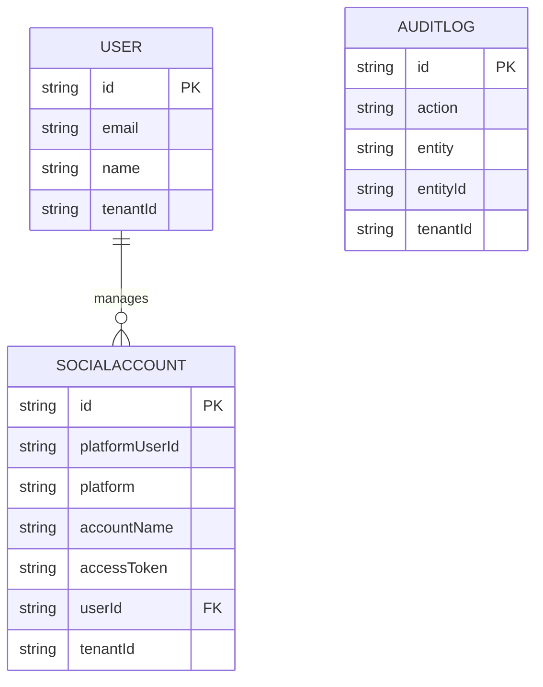

# Modelo Entidad-Relación - Versión 2

Este documento actualiza los esquemas E-R de la versión 1. El antiguo diseño, estructurado con Meseros, Restaurantes y Clientes alrededor de Redes Sociales, ha sido reemplazado por la siguiente topología de datos basada en PostgreSQL administrada por Prisma.

## Entidades Principales

### Entidad: User
Representa a toda persona que se registra y administra recursos (Analista, Administrador, etc.).
- **Atributos Principales**: 
  - `id` (PK)
  - `email` (Unique)
  - `name`
  - `tenantId` (FK Lógica a nivel de infraestructura para el esquema Multi-Tenant)
- **Relación**:
  - `1 -> N` con **SocialAccount**. (Un usuario pertenece a un tenant y puede afiliar múltiples cuentas).

### Entidad: SocialAccount
Representa la página o perfil de meta (Facebook/Instagram).
- **Atributos Principales**:
  - `id` (PK)
  - `platform` ("instagram" u otro)
  - `platformUserId` (Unique, ID propio de Meta)
  - `accessToken`
  - `userId` (FK a **User**)
  - `tenantId`

### Entidad: AuditLog
Permite la auditoría regulatoria estilo "append-only".
- **Atributos Principales**:
  - `id` (PK)
  - `action` (Ej: 'OAUTH_LOGIN_SUCCESS')
  - `userId` (El identificador del responsable del cambio o creación)
  - `tenantId` (Aislamiento lógico de empresas)

## Diagrama Funcional

*Modelo escalable y desacoplado garantizando auditoría total desde el primer momento.*
